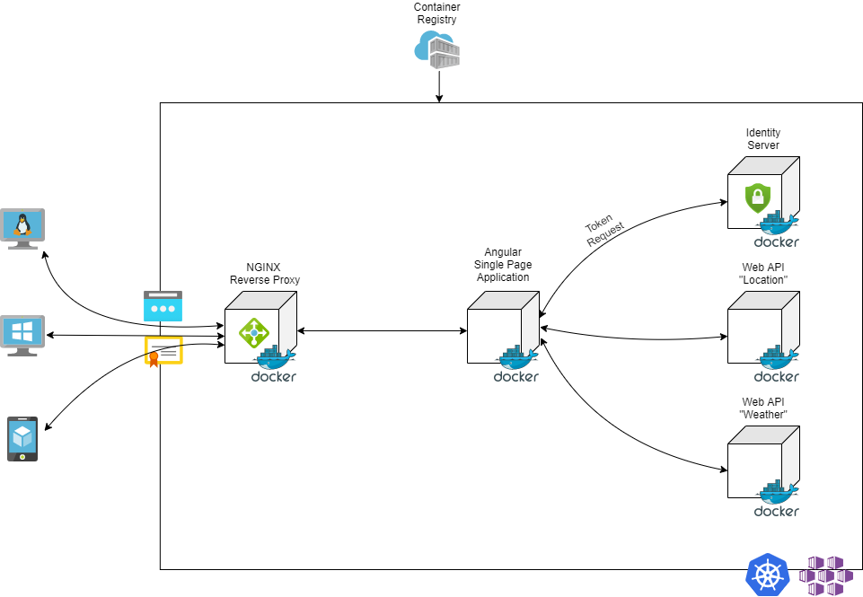
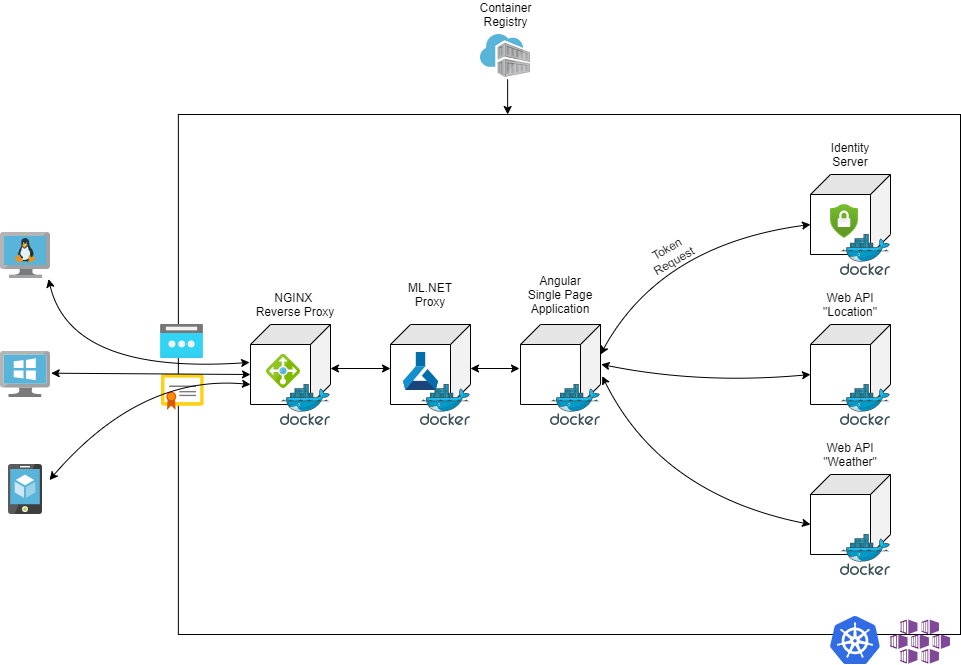
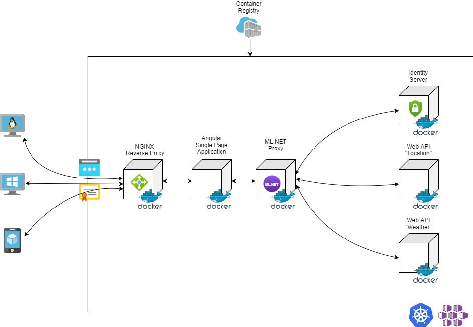

# Bachelor Thesis - "Sicherheitskonzepte für Anwendungen in der Cloud"
## Inhaltsverzeichnis
- [Motivation](#motivation)
- [Architektur](#architektur)
- [Ziel](#ziel)
- [Umsetung](#umsetzung)
- [Betrieb](#betrieb)
- [Links](#links)


## Motivation
Im Rahmen der Thesis "Sicherheitskonzepte für Anwendungen in der Cloud" wird anhand einer bestehenden Cloud-Applikationen eine Mechanismus zur Absicherung der Anwendung konzipiert. Hierbei handelt es sich um einen Software-as-a-Service Dienst, der dem Endkunden zur Verfügung gestellt werden soll. Dieser hat per Definition somit keinerlei Möglichkeiten die Platform oder die darunterliegende Infrastruktur gegen Angriffe von Außerhalb zu konfigurieren. Diese Vorkehrungen müssen aus diesem Grunde von dem Anbieter der Cloud-Dienstes eingerichtet werden. Von Seiten der Rechenzentren, die Dienste wie Platform-as-a-Service oder Infrastructure-as-a-Service anbieten, wird in den häufigsten Fällen direkt an der Firewall auf verdächtiges Verhalten im Netzwerk-Traffic geachtet und bei auftauchenden Anomalien ein vorgefertigtes Protokoll ausgeführt, das die betriebenen Anwendungen von Gefahren wie Denial of Service (DoS) oder Distributed Denial of Service (DDoS) schützen soll. Dies ist jedoch nicht immer gegeben und die Vorkehrungen, die von den Anbietern getroffen werden, sind in den meisten Fällen nicht klar ersichtlich. <br> <br>
Das Endprodukt dieser Arbeit soll durch Verwendung von maschinellen Lernalgorithmen und der Funktion als Proxy den eingehenden Netzwerkverkehr überwachen und bei Anomalien ein Throttling einleiten, das die oben beschriebenen Threat-Modelle abwehren soll. <br>

[back to TOC](#inhaltsverzeichnis)
 
## Architektur
Zur Simulation der vorhandenen Cloud-Umgebung wurde, wie im nachfolgenden Schema skizziert, ein Anwendungsverbund aus NGINX Reverse Proxy (lokaler Ersatz für einen Ingress), einem Duende Identity Server (Identity Provider), zwei Web APIs (schützenswerte Ressourcen) und einer Angular Single Page Applikation konzipiert. <br> <br>
Für das Messen von Metriken und Lastverteilungen wurden zusätzlich eine *Prometheus* und *Grafana* Instanz in die Architektur eingebracht. Zur Log-Analyse wird *Elasticsearch* und *Kibana* verwendet. <br> <br>

<p style="text-align: center;">
 
</p><br><br>

[back to TOC](#inhaltsverzeichnis)

## Ziel
Bei erfolgreicher Implementierung des Intrusion Detection bzw. Prevention Systems (nachfolgend auch ML.Proxy genannt), wird dieser zwischen den NGINX Reverse Proxy bzw. im Kubernetes Kluster direkt hinter den Ingress des Klusters gestellt. Dies soll gewährleisten, dass alle Anfragen, die an das Backend gehen zuerst über den ML.Proxy geprüft und bei verdächtigem Verhalten gedrosselt werden. <br><br>

<p style="text-align: center;">
 
</p><br><br>

[back to TOC](#inhaltsverzeichnis)

## Umsetzung
Im Rahmen dieser Arbeit wurde das Szenario des DoS- bzw. DDoS-Angriffs als Vektor für das Intrusion Detection und Prevention System gewählt. Hierbei werden in der Praxis die Tools [LOIC](https://github.com/NewEraCracker/LOIC), [Slowloris](https://github.com/gkbrk/slowloris) und [GoldenEye](https://github.com/jseidl/GoldenEye) eingesetzt, die auf unterschiedliche Art und Weise einen Denial of Service bei den zu attackierenden Anwendungen auslösen sollen. Nach simulierten Angriffen mit den genannten Anwendungen konnte aufgrund der Deaktivierung des Ports 80 und einer Reduzierung des zulässigen Client-Timeouts beim vorgelagerten NGINX die Gefahren durch LOIC und Slowloris eliminiert werden. Die genaue Ursache, weshalb diese Tools ihre Effektivität auf verteilte Cloud-Anwendungen eingebüst haben, sind in den Kapiteln der Analyse des Soll-Ist-Zustandes der beiliegenden Arbeit zu entnehmen. Einzig das GoldenEye-Tool besitzt die Möglichkeit durch Absetzen von Anfragen mittels TLS 1.2 die Backend-Anwendungen durch den vorgelagerten NGINX zu attackieren. Genau an diesem Punkt setzt die Funktion des ML.Proxy ein. Durch die Verwendung von [YARP](https://github.com/microsoft/reverse-proxy), einer Bibliothek zur Simulation von Proxy-Verhalten mit einer .NET-Webanwendung und [ML.NET](https://github.com/dotnet/machinelearning), konnte ein Mechanismus etabliert werden, der eingehende Angriffe aufgrund ihrer Paketgröße identifiziert und blockt. Für das Mitschneiden der Netzwerkpakete wurde [SharpPcap](https://github.com/chmorgan/sharppcap) und [Packet.NET](https://github.com/chmorgan/packetnet) eingesetzt, die es ermöglichen Netzwerkverkehr auf den vorhandenen Netzwerkinterfaces abzuhören und zu prozessieren. Für das Throtteling bzw. Blockieren der einzelnen Anfragen kam die Bibliothek [ThrottlR](https://github.com/Kahbazi/ThrottlR) zum Einsatz. Hier wurden vereinzelt Änderungen vorgenommen, damit die bereitgestellte Middleware auf die eingeführten `Attack-Header` reagiert und die markierten Anfragen blockt. Die verwendeten Trainingsdatensätze sind Teil eines Projektes der [University of New Brunswick](https://www.unb.ca/cic/datasets/ids-2018.html), die auf Basis einer simulierten Anwendungslandschaft innerhalb einer AWS Infrastruktur Angriffe simuliert und den aufgetretenen Netzwerkverkehr mitgeschnitten hat. Für die Erstellung der Datensätze und die Berechnung der enthaltenen Werte kam die Software [CICFlowMeter-V3](https://github.com/CanadianInstituteForCybersecurity/CICFlowMeter) zum Einsatz, die als Grundlage für die Berechnung der eigenen verwendeten Werte innerhalb des ML.Proxy, fungierte.

<p style="text-align: center;">
 
</p><br><br>

[back to TOC](#inhaltsverzeichnis)

## Betrieb
Für den Start der Anwendung muss eine [Docker Desktop](https://www.docker.com/products/docker-desktop) Version auf dem lokalen Rechner installiert sein. Anschließend kann die Anwendung entweder innerhalb von Visual Studio oder mittels des Docker-Compose Befehls im Root-Verzeichnis des Projektes gestartet werden:
```pwsh
docker-compose up -d --build
``` 
Des Weiteren besteht die Möglichkeit für den Betrieb in einem Kubernetes-Kluster. Die Manifest-Files und Deployment-Skripte für die Ausführung via Powershell liegen dem Projekt bei. Verwendet werden sie wie folgt:
```pwsh
# Baut die Container und transferiert sie auf eine Container Registry
.\BuildContainerAndPushToRegistry.ps1 Build

# Platziert die Anwendung innerhalb eines Namespaces im Kubernetes Kluster
.\manifests\DeployToAzure.ps1 Install
```
<br> <br>

[back to TOC](#inhaltsverzeichnis)

## Links
- Prometheus Konfiguration für Docker-Compose aus dem aktuellen [Repo](https://github.com/vegasbrianc/prometheus/blob/master/docker-compose.yml)
- Angular OAuth OIDC Package Konfiguration aus dem aktuellen [Repo](https://github.com/damienbod/angular-auth-oidc-client) 
- Konfiguration für das Grafana Dashboard von [hier](https://dale-bingham-cingulara.medium.com/net-core-web-api-metrics-with-prometheus-and-grafana-fe84a52d9843)
- "Adding ML.NET to your Web APIs", .NET Live [Video](https://www.youtube.com/watch?v=THVD4nzi8vk)
- Fortführende Dokumentation zu ML.NET bei [Microsoft Learn](https://dotnet.microsoft.com/learn/ml-dotnet)
- Weitere [.NET Community Standups](https://dotnet.microsoft.com/live/community-standupPer) zum Thema ML.NET
- Metriken aus dem NGINX auslesen von [hier](https://www.datadoghq.com/blog/how-to-collect-nginx-metrics/)
<br> <br>

[back to TOC](#inhaltsverzeichnis)