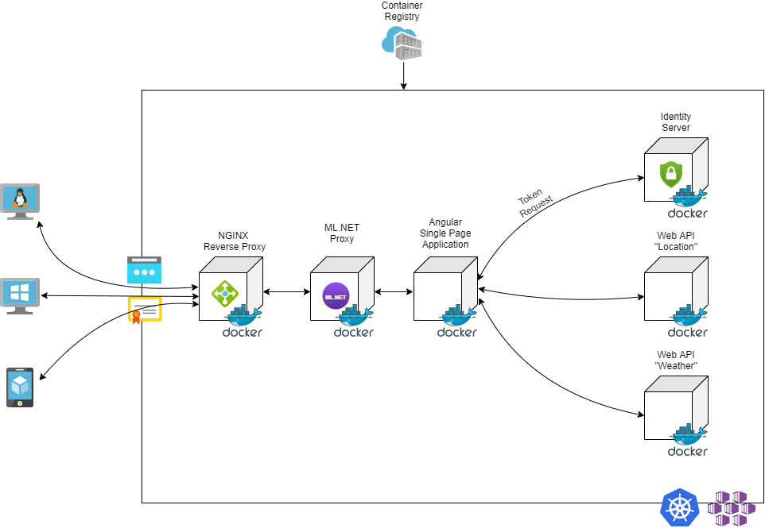

# Bachelor Thesis - "Sicherheitskonzepte für Anwendungen in der Cloud"
## Inhaltsverzeichnis
- [Motivation](#motivation)
- [Architektur](#architektur)
- [Ziel](#ziel)
- [Links](#links)

## Motivation
Im Rahmen der Thesis "Sicherheitskonzepte für Anwendungen in der Cloud" wird anhand einer bestehenden Cloud-Applikationen eine Mechanismus zur Absicherung der Anwendung konzipiert. Hierbei handelt es sich um einen Software-as-a-Service Dienst, der dem Endkunden zur Verfügung gestellt werden soll. Dieser hat per Definition somit keinerlei Möglichkeiten die Platform oder die darunterliegende Infrastruktur gegen Angriffe von Außerhalb zu konfigurieren. Diese Vorkehrungen müssen aus diesem Grunde von dem Anbieter der Cloud-Dienstes eingerichtet werden. Von Seiten der Rechenzentren, die Dienste wie Platform-as-a-Service oder Infrastructure-as-a-Service anbieten, wird in den häufigsten Fällen direkt an der Firewall auf verdächtiges Verhalten im Netzwerk-Traffic geachtet und bei auftauchenden Anomalien ein vorgefertigtes Protokoll ausgeführt, das die betriebenen Anwendungen von Gefahren wie Denial of Service (DoS) oder Distributed Denial of Service (DDoS) schützen soll. Dies ist jedoch nicht immer gegeben und die Vorkehrungen, die von den Anbietern getroffen werden, sind in den meisten Fällen nicht klar ersichtlich.    
Das Endprodukt dieser Arbeit soll durch Verwendung von maschinellen Lernalgorithmen und der Funktion als Proxy den eingehenden Netzwerkverkehr überwachen und bei Anomalien ein Throttling einleiten, das die oben beschriebenen Threat-Modelle abwehren soll.
[back to TOC](#inhaltsverzeichnis)
 
## Architektur
Zur Simulation der vorhandenen Cloud-Umgebung wurde, wie im nachfolgenden Schema skizziert, ein Anwendungsverbund aus NGINX Reverse Proxy (lokaler Ersatz für einen Ingress), einem Duende Identity Server (Identity Provider), zwei Web APIs (schützenswerte Ressourcen) und einer Angular Single Page Applikation konzipiert.    
Für das Messen von Metriken und Lastverteilungen wurden zusätzlich eine *Prometheus* und *Grafana* Instanz in die Architektur eingebracht. Zur Log-Analyse wird *Elasticsearch* und *Kibana* verwendet.    
 
    
[back to TOC](#inhaltsverzeichnis)

## Ziel
Bei erfolgreicher Implementierung des Intrusion Detection bzw. Prevention Systems (nachfolgend auch ML.NET Proxy genannt), wird dieser zwischen den NGINX Reverse Proxy bzw. im Kubernetes Kluster direkt hinter den Ingress des Klusters gestellt. Dies soll gewährleisten, dass alle Anfragen, die an das Backend gehen zuerst über den ML.NET Proxy geprüft und bei verdächtigem Verhalten gedrosselt werden.   

<b>Genaue Konzeption und Implementierung folgt...</b>

    
[back to TOC](#inhaltsverzeichnis)

### Links
- Prometheus Konfiguration für Docker-Compose aus dem aktuellen [Repo](https://github.com/vegasbrianc/prometheus/blob/master/docker-compose.yml)
- Angular OAuth OIDC Package Konfiguration aus dem aktuellen [Repo](https://github.com/damienbod/angular-auth-oidc-client)    

[back to TOC](#inhaltsverzeichnis)